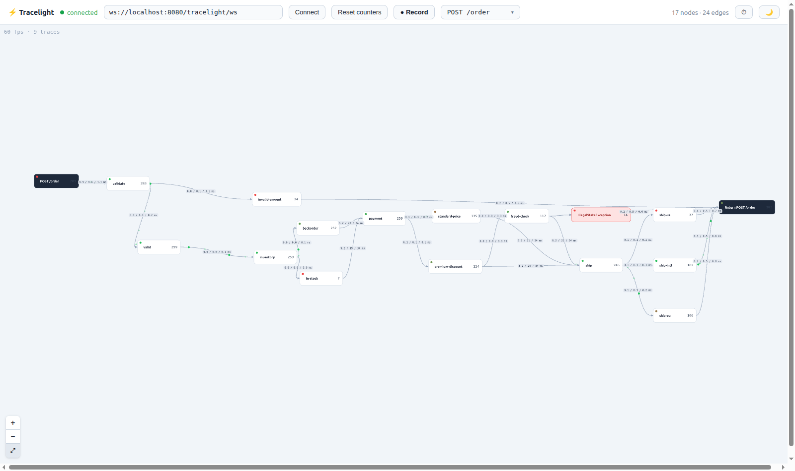
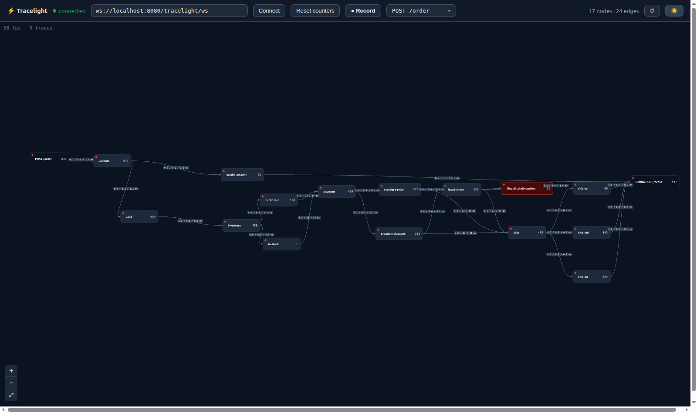
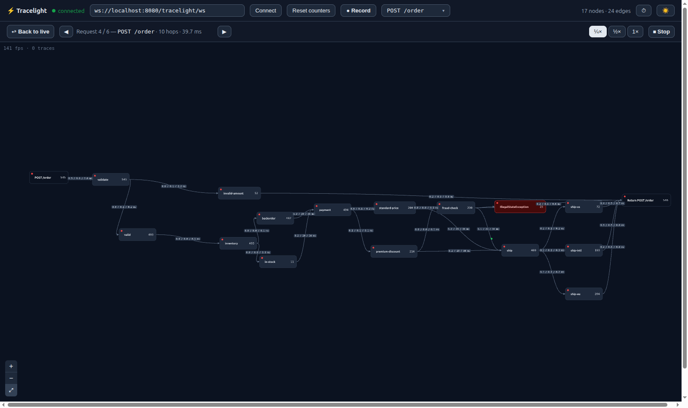

# Tracelight

[](LICENSE)
[](https://central.sonatype.com/namespace/io.github.bee-soft-tech)

**See where a request is in your code — live.**



Tracelight is a **live, application-level request-flow visualizer**. You drop a few points in
your code; the frontend shows a graph where a node **pulses**, its **counter ticks**, and a
**dot flies along the edge** the instant a request passes through it. It's a real-time
"you are here" for your running app — the current picture, not a report after the fact.

> It answers one question other tools don't: **"where in my code is traffic flowing right now?"**

---

## What it is — and what it isn't

|  |  |
|---|---|
| ✅ **Live** | the current picture, updated on every hit — no history, no storage |
| ✅ **Code-level** | nodes are points in *your* code (methods, `if`/`switch` branches), not just services or endpoints |
| ✅ **Self-assembling** | the topology discovers itself from real traffic (`previous hit → current hit = edge`) |
| ✅ **Visual** | pulse + counter + flying dot + per-edge `min / avg / max` latency |
| ❌ **Not a tracer** | no span trees, no historical queries — reach for Jaeger / OpenTelemetry for that |
| ❌ **Not infra / eBPF** | it doesn't watch the kernel or network — it watches *your code paths* |

### Where it fits

Three different planes — Tracelight lives on the top one:

| Layer | Answers | Examples |
|---|---|---|
| Infra / system | who talks to whom on the network | eBPF: Pixie, Cilium, Anteon |
| APM / tracing | request spans, **historically** | OpenTelemetry, Jaeger, Datadog, Micrometer Tracing |
| **Live code-flow** | where requests are in your code **right now** | **Tracelight** |

Classic APM shows you a trace tree *after* the request finished. Tracelight shows you the
**live** flow through your code as it happens — instrumented with one annotation, visualized
as a self-discovering graph.

---

## Screenshots

Live `POST /order` flow — every branch is its own node, with per-edge `min / avg / max` latency and
a red node where an exception was thrown:


Dark mode (follows your browser, or toggle it):



**Record & replay:** stop the live view and replay one captured request in slow motion — the dot
crawls its real path, lingering on the hops where the request actually spent time:



---

## Features

- 🟢 **Real-time pulse** — node blinks + a dot flies along the edge the moment a request crosses it.
- 🧭 **Self-discovering topology** — no config; the graph builds itself from real traffic.
- ⏱ **Per-edge latency** — `min / avg / max` time *between* points, shown over the edge (toggleable).
- 🎥 **Record & replay (DVR)** — record live traffic, then step through the captured requests and
  replay any one in **slow motion** at its real per-hop latency — see exactly where a request spent
  its time.
- 💥 **Exception nodes** — a thrown exception becomes a red `point!ExceptionType` node with a hit
  counter; click it to read the stack trace.
- 🎯 **Route focus** — pick an entry point to view just that route's reachable subgraph.
- 🖼 **WebGL renderer** — `<TraceGraph>` (PixiJS/WebGL + elkjs) stays smooth with thousands of
  dots in flight.
- 🌗 **Dark mode** — follows `prefers-color-scheme` or via a toggle.
- 🖱 **Interactive** — drag nodes, pan, zoom.
- 🔌 **Tiny integration** — one annotation on the backend, one hook + one component on the frontend.

---

## How it works

1. You mark points in code: `@TracePoint("name")` on a method, or `Tracelight.hit("name")`
   anywhere (e.g. inside an `if`).
2. A request filter opens a `ThreadLocal` trace context per request. Each `hit` records an edge
   `previous-point → current-point`, so the **graph discovers itself** from real traffic.
3. The library broadcasts lightweight JSON events over a WebSocket (`/tracelight/ws`).
4. The React component lays the graph out left→right (elkjs) and animates pulses in real time.

Tracelight ships two backend adapters over a shared, transport-agnostic core, so the **same**
`@TracePoint` / `Tracelight.hit()` API, `tracelight.*` properties, WebSocket endpoint, and UI work
on either stack:

- **`tracelight-spring-mvc`** — servlet / Spring MVC. A `ThreadLocal` context on the request thread.
- **`tracelight-webflux`** — reactive / Spring WebFlux. The `ThreadLocal` context is bridged into
  the Reactor Context (Micrometer context-propagation), so it survives thread hops across the
  reactive pipeline — `Tracelight.hit()` works unchanged inside `Mono`/`Flux` operators.

> **Reactive limitation:** the graph assumes roughly linear execution per request
> (`currentNodeId` = the last point hit), so genuinely concurrent operators (`flatMap` with
> concurrency > 1, `parallel()`) may interleave edges — the same caveat the servlet adapter has
> when user code spawns its own threads.

---

## Record & replay

Individual requests are impossible to follow at real traffic rates — they flash by and overlap.
The toolbar's **● Record** captures every completed request; **■ Stop** freezes the live view and
drops you into a review bar:

- **◀ Prev / Next ▶** — step through the captured requests (each labelled `entry · hops · total ms`).
- **¼× / ½× / 1×** — replay speed.
- **🐢 Play** — replay the selected request in slow motion, looping. A single dot crawls its exact
  recorded path and **lingers on the slow hops**, because each hop is played back at its real
  latency. Selecting a request auto-focuses its route so all its nodes are visible.
- **↩ Back to live** (or `Esc`) — leave review and resume live monitoring.

While reviewing, the live graph is frozen (counters and dots hold still) even though requests keep
arriving underneath — nothing is lost; it all flushes when you go back to live.

> **Immediate mode only.** Replay reconstructs each request from its per-request
> `open` / `pulse` / `close` frames and the real per-hop latency carried on each `pulse`, so it
> requires `tracelight.flush-interval-ms: 0` (the demo's setting). In batched mode there are no
> per-request frames, so recording captures nothing.

The recorder is part of `@tracelight/react` (`useTraceRecorder(graph)` → `RecordedTrace[]`), and
`<TraceGraph>` accepts `frozen` / `replayTrace` / `replaySpeed` to drive it — the demo web app wires
these into the toolbar above.

---

## Quick start (run the demo)

```bash
# 1. Backend — Spring Boot demo (downloads Gradle 8.7 via the wrapper on first run)
./gradlew :tracelight-demo-app:bootRun

# 2. Frontend — Vite dev server (http://localhost:5173)
npm install
npm run dev -w tracelight-web

# 3. Generate traffic
cd tracelight-load && python -m tracelight_load --url http://localhost:8080 --rps 50
```

Open the web app and watch the graph light up. Toggle **dark mode** in the toolbar; crank
`--rps` to stress it.

---

## Use it in your own app

**Backend** — add `tracelight-spring-mvc` (servlet apps) or `tracelight-webflux` (reactive apps),
then annotate methods and use `Tracelight.hit()` for branches. The WebSocket endpoint is
auto-configured; no wiring needed. The instrumentation API is identical on both stacks.

```java
@TracePoint("validate")
public boolean validate(Order order) {
    if (order.amount() <= 0) {
        Tracelight.hit("invalid-amount");   // a branch becomes its own node + edge
        return false;
    }
    Tracelight.hit("valid");
    return true;
}
```

**Frontend** (`@tracelight/react`) — connect the hook to the WebSocket and mount a renderer:

```tsx
import { TraceGraph, useTracelight } from '@tracelight/react';
import '@tracelight/react/styles.css';

export function App() {
  const graph = useTracelight('ws://localhost:8080/tracelight/ws');
  return <TraceGraph graph={graph} showTimings colorMode="system" />;
}
```

### Configuration (`tracelight.*`)

| Property | Default | Meaning |
|---|---|---|
| `tracelight.enabled` | `true` | Master switch. |
| `tracelight.base-path` | `/tracelight` | Endpoint base; the WebSocket lives at `base-path + "/ws"`. |
| `tracelight.flush-interval-ms` | `100` | Coalesce hits into batched events (`0` = one `pulse` per hit). |

---

## Frontend animation & layout tuning (`gl/constants.ts`)

Every knob controlling how requests animate and how nodes space themselves lives in one file,
[`tracelight-react/src/gl/constants.ts`](tracelight-react/src/gl/constants.ts). Nothing else in
the renderer hardcodes these numbers — change them here and rebuild `@tracelight/react`.

| Constant | Default | Meaning |
|---|---|---|
| `HOP_DISTANCE_FACTOR` | `0.15` | ms of travel time per world-space pixel of edge length. |
| `HOP_MIN_MS` | `80` | Floor on a single hop's duration, regardless of edge length. |
| `HOP_MAX_MS` | `150` | Ceiling on a single hop's duration, regardless of edge length. |
| `TRAIL_LENGTH` | `4` | Number of fading circles drawn behind the head dot. |
| `TRAIL_ALPHA_BASE` | `0.4` | Opacity of the trail segment right behind the head dot. |
| `TRACE_TTL_MS` | `30000` | Idle time before an orphaned request's animation is force-evicted. |
| `REPLAY_HOP_BASE_MS` | `180` | Slow-mo replay: base on-screen ms every hop gets (keeps fast hops visible). |
| `REPLAY_MS_SCALE` | `120` | Slow-mo replay: on-screen ms added per ms of a hop's real latency. |
| `REPLAY_HOP_MAX_MS` | `1500` | Slow-mo replay: ceiling on a hop's base duration, before the rate divisor. |
| `REPLAY_LOOP_GAP_MS` | `600` | Slow-mo replay: pause between loop iterations. |
| `NODE_MIN_DIST` | `200` | Minimum center-to-center distance enforced between nodes. |
| `SPACING_ITERATIONS` | `3` | Relaxation passes used to enforce `NODE_MIN_DIST`. |

### Hop playback: `HOP_DISTANCE_FACTOR`, `HOP_MIN_MS`, `HOP_MAX_MS`

A request is played back as a queue of hops — one per edge it crosses — drained strictly in
order on the animation ticker, never all at once, even when the backend events for a request
all arrive within the same millisecond. Each hop's on-screen duration is:

```
duration = clamp(pixelDistance(from, to) * HOP_DISTANCE_FACTOR, HOP_MIN_MS, HOP_MAX_MS)
```

- **`HOP_DISTANCE_FACTOR`** is the ms-per-pixel travel rate. Raising it makes every hop take
  longer per pixel of edge length — the whole graph feels slower and more deliberate. Lowering
  it makes dots snappier, at the cost of long edges reading as more of a blur.
- **`HOP_MIN_MS`** stops very short edges (adjacent, tightly-packed nodes) from resolving in a
  handful of milliseconds, which would look like a flicker rather than motion. If short hops in
  your graph still feel too fast, raise this.
- **`HOP_MAX_MS`** stops very long edges from taking forever to cross, and — just as
  importantly — puts a hard ceiling on how long a whole request takes to play back: a request
  with *N* hops finishes in at most `N * HOP_MAX_MS`. If you have graphs with many hops per
  request and want the full playback to stay snappy even under a burst of traffic, lower this.

These three interact: `HOP_DISTANCE_FACTOR` only has room to vary hop speed *between*
`HOP_MIN_MS` and `HOP_MAX_MS` — if your graph's edges are all short, most hops will sit at the
floor regardless of the factor; if they're all long, most will sit at the ceiling.

### Motion trail: `TRAIL_LENGTH`, `TRAIL_ALPHA_BASE`

Every active dot leaves a short comet-tail of fading circles behind it — this is what makes the
fastest hops (near `HOP_MIN_MS`) still read as *movement* instead of a single flash.

- **`TRAIL_LENGTH`** is how many trail segments are drawn (plus the head dot itself). More
  segments make the tail longer and the motion read more smoothly, at the cost of one extra
  pooled `Graphics` object per segment, per concurrently-animating request.
- **`TRAIL_ALPHA_BASE`** is the opacity of the segment immediately behind the head; each older
  segment fades linearly from there down to fully transparent by the `TRAIL_LENGTH`-th segment.
  Raise it for a more visible tail, lower it for a subtler one.

### Missed-close safety net: `TRACE_TTL_MS`

Each request's playback queue is normally deleted the moment the backend's `close` event
arrives *and* the queue has fully drained (see the request-lifecycle events in
`tracelight-core`). `TRACE_TTL_MS` is the fallback for when that `close` event never arrives —
a dropped WebSocket frame, a request whose filter didn't run to completion, etc. If a request's
playback has sat idle (not `closing`, nothing queued) for longer than this many ms, it's
force-evicted so it can't linger as a permanent "ghost" entry. There's no visible harm in this
number being generous — it only fires on the error path — but too low a value risks evicting a
slow, legitimately still-open request. Raise it if your app has requests that can pause for a
long time mid-flight; lower it if you want stuck requests cleaned up faster.

### Slow-motion replay: `REPLAY_HOP_BASE_MS`, `REPLAY_MS_SCALE`, `REPLAY_HOP_MAX_MS`, `REPLAY_LOOP_GAP_MS`

These govern the **Record & replay** slow-motion playback (they don't affect live animation). A
recorded hop's on-screen duration is:

```
duration = clamp(REPLAY_HOP_BASE_MS + realMs * REPLAY_MS_SCALE, REPLAY_HOP_BASE_MS, REPLAY_HOP_MAX_MS) / rate
```

where `realMs` is that hop's true latency (carried on the `pulse`) and `rate` is the ¼×/½×/1× toggle.

- **`REPLAY_HOP_BASE_MS`** is the floor every hop gets, so even a sub-millisecond in-process hop is
  still visible as motion rather than a flash.
- **`REPLAY_MS_SCALE`** amplifies real latency into on-screen time — it's large because in-process
  hops are often sub-ms, and this is what makes a genuinely slow hop visibly *linger*. Raise it to
  exaggerate latency differences, lower it to flatten them.
- **`REPLAY_HOP_MAX_MS`** caps a single hop so a real tens-of-ms hop (e.g. a slow DB call) doesn't
  crawl for a minute even at ¼×.
- **`REPLAY_LOOP_GAP_MS`** is the brief rest between loop iterations so the restart reads as a new
  play-through rather than a jump.

### Node spacing: `NODE_MIN_DIST`, `SPACING_ITERATIONS`

Nodes are draggable rounded rectangles (~170×56 px by default), and `NODE_MIN_DIST` is the
minimum distance allowed between any two node **centers** — enforced three ways:

1. **While dragging** — every frame, the dragged node is pushed radially out of any neighbor
   closer than `NODE_MIN_DIST`, so it slides along the boundary instead of overlapping.
2. **On layout sync** — after ELK positions new nodes, any pair still closer than
   `NODE_MIN_DIST` (e.g. a freshly-placed node landing near a hand-dragged one) is relaxed apart.
3. **In ELK's own layout** — `layout.ts` derives ELK's same-layer node spacing from this same
   constant (`elk.spacing.nodeNode = NODE_MIN_DIST - nodeHeight`), so a fresh auto-layout is
   already conformant and steps 1–2 rarely have to do anything.

Raise `NODE_MIN_DIST` for more breathing room between nodes (useful with long labels or high
zoom); lower it to pack the graph tighter. Because it feeds ELK's layout spacing too, changing
it reflows freshly-laid-out graphs, not just drag behavior.

**`SPACING_ITERATIONS`** is how many relaxation passes are run each time (per drag-frame, and
once on sync): pushing a node out of one neighbor's radius can push it *into* another neighbor's
radius, so a single pass isn't always enough to fully resolve a cluster. More iterations
converge tighter clusters more reliably, at a small, bounded CPU cost per frame; fewer
iterations are cheaper but can leave a rare residual overlap in dense areas.

---

## Modules

| Module | What it is |
|---|---|
| [`tracelight-core`](tracelight-core/) | Transport-agnostic core: `@TracePoint`, `Tracelight.hit()`, `TraceContext`, in-memory graph, event serialization, `MessageSink` interface. No web dependency. |
| [`tracelight-spring-mvc`](tracelight-spring-mvc/) | Servlet / Spring MVC adapter: request filter, AOP aspect, WebSocket transport, auto-configured at `/tracelight/ws`. |
| [`tracelight-webflux`](tracelight-webflux/) | Reactive / Spring WebFlux adapter: `WebFilter`, reactive `@Around` aspect, reactive WebSocket transport (emission serialized so topology frames aren't dropped under concurrent load), Reactor Context propagation. Same API and endpoints as the MVC adapter. |
| [`tracelight-react`](tracelight-react/) | `@tracelight/react` — `useTracelight()` hook + headless `<TraceGraph>` (PixiJS/WebGL + elkjs). |
| [`tracelight-web`](tracelight-web/) | Demo site mounting the renderers, with renderer / dark-mode / timings toggles. |
| [`tracelight-demo-app`](tracelight-demo-app/) | Servlet Spring Boot demo service with branching endpoints, instrumented. |
| [`tracelight-webflux-demo`](tracelight-webflux-demo/) | Reactive (WebFlux) Spring Boot demo service, mirroring the servlet demo with `Mono`/`Flux` endpoints. |
| [`tracelight-load`](tracelight-load/) | Python (httpx + asyncio) load generator. |

---

## Requirements

- **Java 17+** (Gradle 8.7 is fetched automatically by the wrapper — use `./gradlew`)
- **Node 18+ / npm**
- **Python 3.9+** (only for the load generator)

## Support

If Tracelight is useful to you, you can support its development:

☕ **[Donate via PayPal](https://paypal.me/BoskyTomasz)**

## License

[Apache License 2.0](LICENSE) © 2026 Bosky Tomasz (bee-soft-tech)
