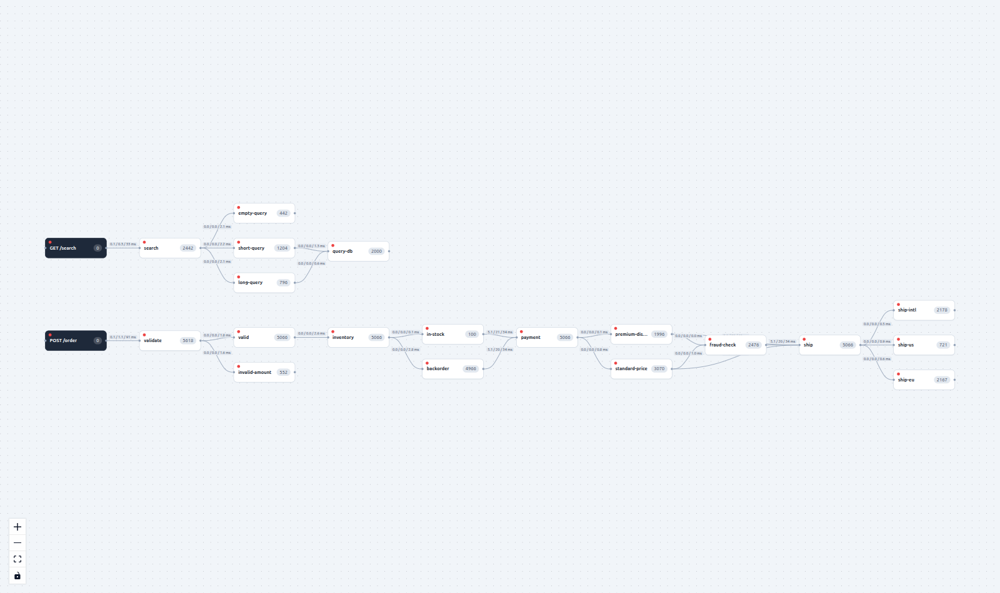

# Tracelight

**See where a request is in your code — live.**



Tracelight is a **live, application-level request-flow visualizer**. You drop a few points in
your code; the frontend shows a graph where a node **pulses**, its **counter ticks**, and a
**dot flies along the edge** the instant a request passes through it. It's a real-time
"you are here" for your running app — the current picture, not a report after the fact.

> It answers one question other tools don't: **"where in my code is traffic flowing right now?"**

---

## What it is — and what it isn't

|  |  |
|---|---|
| ✅ **Live** | the current picture, updated on every hit — no history, no storage |
| ✅ **Code-level** | nodes are points in *your* code (methods, `if`/`switch` branches), not just services or endpoints |
| ✅ **Self-assembling** | the topology discovers itself from real traffic (`previous hit → current hit = edge`) |
| ✅ **Visual** | pulse + counter + flying dot + per-edge `min / avg / max` latency |
| ❌ **Not a tracer** | no span trees, no historical queries — reach for Jaeger / OpenTelemetry for that |
| ❌ **Not infra / eBPF** | it doesn't watch the kernel or network — it watches *your code paths* |

### Where it fits

Three different planes — Tracelight lives on the top one:

| Layer | Answers | Examples |
|---|---|---|
| Infra / system | who talks to whom on the network | eBPF: Pixie, Cilium, Anteon |
| APM / tracing | request spans, **historically** | OpenTelemetry, Jaeger, Datadog, Micrometer Tracing |
| **Live code-flow** | where requests are in your code **right now** | **Tracelight** |

Classic APM shows you a trace tree *after* the request finished. Tracelight shows you the
**live** flow through your code as it happens — instrumented with one annotation, visualized
as a self-discovering graph.

---

## Screenshots

| React Flow renderer (default) | WebGL renderer (experimental) |
|---|---|
|  |  |

Dark mode (follows your browser, or toggle it):


---

## Features

- 🟢 **Real-time pulse** — node blinks + a dot flies along the edge the moment a request crosses it.
- 🧭 **Self-discovering topology** — no config; the graph builds itself from real traffic.
- ⏱ **Per-edge latency** — `min / avg / max` time *between* points, shown over the edge (toggleable).
- 🖼 **Two renderers** — `<TraceGraph>` (React Flow + elkjs) by default, or the experimental
  `<TraceGraphGL>` (PixiJS/WebGL) that stays smooth with thousands of dots in flight.
- 🌗 **Dark mode** — follows `prefers-color-scheme` or via a toggle.
- 🖱 **Interactive** — drag nodes, pan, zoom.
- 🔌 **Tiny integration** — one annotation on the backend, one hook + one component on the frontend.

---

## How it works

1. You mark points in code: `@TracePoint("name")` on a method, or `Tracelight.hit("name")`
   anywhere (e.g. inside an `if`).
2. A servlet filter opens a `ThreadLocal` trace context per request. Each `hit` records an edge
   `previous-point → current-point`, so the **graph discovers itself** from real traffic.
3. The library broadcasts lightweight JSON events over a WebSocket (`/tracelight/ws`).
4. The React component lays the graph out left→right (elkjs) and animates pulses in real time.

> **MVP limitation:** the `ThreadLocal` context targets **synchronous Spring MVC**; it does not
> cross async/reactive boundaries.

---

## Two renderers: React Flow vs WebGL

Both renderers draw the **same graph from the same data** — they differ only in *how* they paint.

| | `<TraceGraph>` — React Flow | `<TraceGraphGL>` — WebGL (PixiJS) |
|---|---|---|
| Technology | **DOM + SVG** (one HTML element per node, an SVG `<path>` per edge) | **WebGL** — everything is GPU-drawn sprites on a single `<canvas>` |
| Rendered by | the browser's layout engine + compositor | the GPU |
| A moving dot costs | a real element to lay out & repaint each frame | a coordinate update on the GPU |
| Scales with | number of DOM elements | mostly pixels/sprites (much cheaper) |
| Stays smooth up to | hundreds of moving elements | **thousands of dots in flight** |
| Free extras | accessibility (screen-reader nodes), CSS styling, hit-testing | — (drawn manually) |

**Rule of thumb:**

- **React Flow** (default) — accessible, easy to style, simpler. Great for normal traffic.
- **WebGL** — when you push heavy traffic and want every request to show as a dot flowing along
  the path. It holds 120 fps with 100+ dots in flight, where DOM-based rendering starts to stutter.

> This is the same architectural split you see across graph libraries: DOM/SVG tools (React Flow,
> d3) favour convenience and accessibility; WebGL tools (Sigma.js, Cosmograph, Netflix's Vizceral)
> favour raw throughput. Tracelight ships both so you can pick per use case.

---

## Quick start (run the demo)

```bash
# 1. Backend — Spring Boot demo (downloads Gradle 8.7 via the wrapper on first run)
./gradlew :tracelight-demo-app:bootRun

# 2. Frontend — Vite dev server (http://localhost:5173)
npm install
npm run dev -w tracelight-web

# 3. Generate traffic
cd tracelight-load && python -m tracelight_load --url http://localhost:8080 --rps 50
```

Open the web app and watch the graph light up. Toggle **React Flow / WebGL** and **dark mode**
in the toolbar; crank `--rps` to stress it.

---

## Use it in your own app

**Backend** (`tracelight-spring`) — annotate methods, and use `Tracelight.hit()` for branches.
The WebSocket endpoint is auto-configured; no wiring needed.

```java
@TracePoint("validate")
public boolean validate(Order order) {
    if (order.amount() <= 0) {
        Tracelight.hit("invalid-amount");   // a branch becomes its own node + edge
        return false;
    }
    Tracelight.hit("valid");
    return true;
}
```

**Frontend** (`@tracelight/react`) — connect the hook to the WebSocket and mount a renderer:

```tsx
import { TraceGraph, useTracelight } from '@tracelight/react';
import '@tracelight/react/styles.css';

export function App() {
  const graph = useTracelight('ws://localhost:8080/tracelight/ws');
  return <TraceGraph graph={graph} showTimings colorMode="system" />;
}
```

Swap in the WebGL renderer with the same data — `<TraceGraphGL graph={graph} />`.

### Configuration (`tracelight.*`)

| Property | Default | Meaning |
|---|---|---|
| `tracelight.enabled` | `true` | Master switch. |
| `tracelight.base-path` | `/tracelight` | Endpoint base; the WebSocket lives at `base-path + "/ws"`. |
| `tracelight.flush-interval-ms` | `100` | Coalesce hits into batched events (`0` = one `pulse` per hit). |

---

## Modules

| Module | What it is |
|---|---|
| [`tracelight-spring`](tracelight-spring/) | Java / Spring Boot 3 library (the core): `@TracePoint`, `Tracelight.hit()`, `ThreadLocal` context, in-memory graph, auto-configured WebSocket at `/tracelight/ws`. |
| [`tracelight-react`](tracelight-react/) | `@tracelight/react` — `useTracelight()` hook + headless `<TraceGraph>` (React Flow + elkjs) and `<TraceGraphGL>` (PixiJS/WebGL). |
| [`tracelight-web`](tracelight-web/) | Demo site mounting the renderers, with renderer / dark-mode / timings toggles. |
| [`tracelight-demo-app`](tracelight-demo-app/) | Spring Boot demo service with branching endpoints, instrumented. |
| [`tracelight-load`](tracelight-load/) | Python (httpx + asyncio) load generator. |

---

## Requirements

- **Java 17+** (Gradle 8.7 is fetched automatically by the wrapper — use `./gradlew`)
- **Node 18+ / npm**
- **Python 3.9+** (only for the load generator)

## License

MIT
